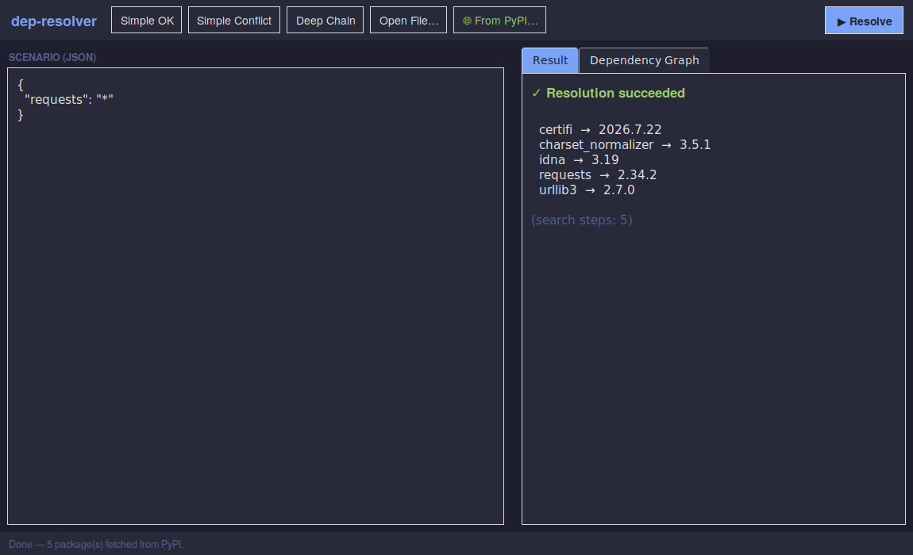
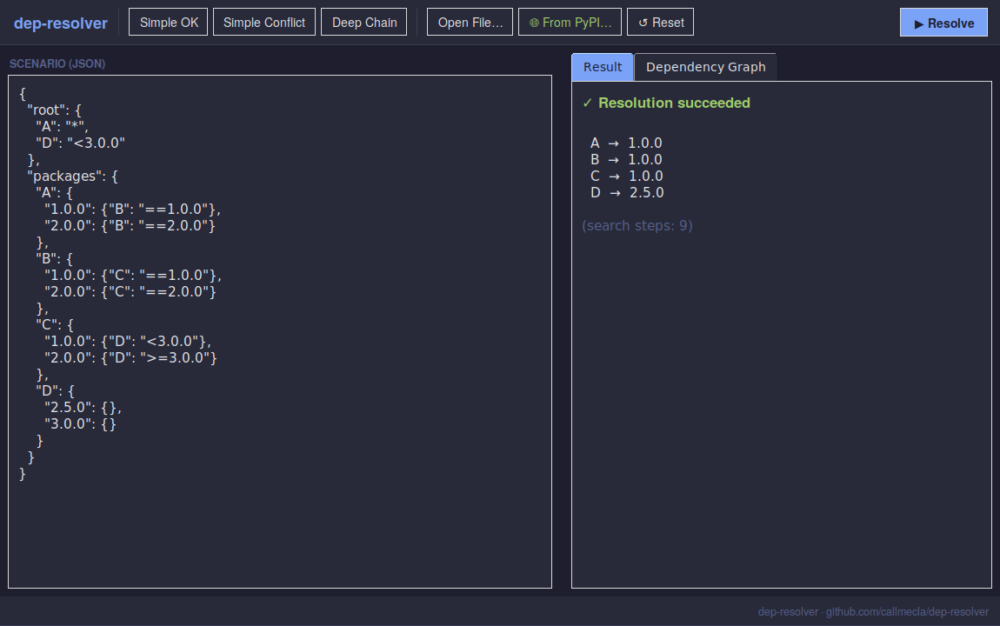
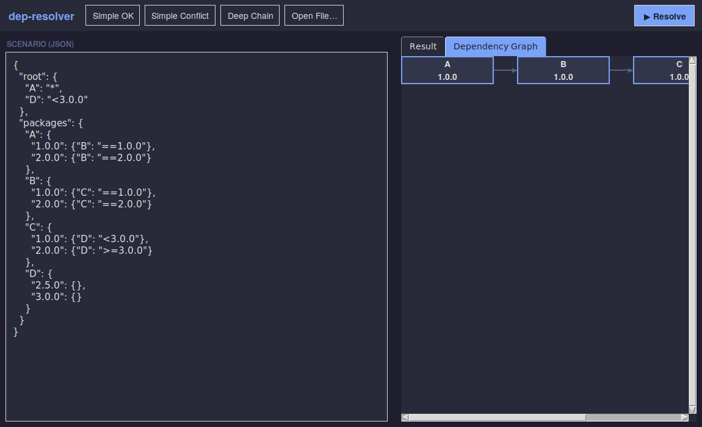

# dep-resolver

A small dependency version resolver — the kind of thing `pip`, `npm`, or
`cargo` runs under the hood every time you install something.

Given a set of packages, the versions available for each, and what each
version depends on, `dep-resolver` finds a combination of versions that
satisfies every constraint — or explains clearly *why* no such combination
exists.

## Why

Every real package manager solves this problem, and it's a classic example
of constraint satisfaction: hard in general, but tractable for realistic
inputs. This is a from-scratch implementation of the core idea — no
external solver libraries — using backtracking search.

## Usage

```bash
python resolve.py examples/simple_ok.json
python resolve.py examples/simple_conflict.json --verbose
```

### Example: successful resolution

```json
{
  "root": { "A": ">=1.0.0", "B": "*" },
  "packages": {
    "A": { "1.0.0": {"C": ">=2.0.0"}, "1.1.0": {"C": ">=2.0.0"} },
    "B": { "1.0.0": {"C": ">=2.0.0,<3.0.0"} },
    "C": { "1.5.0": {}, "2.0.0": {}, "2.1.0": {} }
  }
}
```

```
$ python resolve.py examples/simple_ok.json
Resolution succeeded:

  A -> 1.1.0
  B -> 1.0.0
  C -> 2.1.0
```

### Example: unsatisfiable constraints

```
$ python resolve.py examples/simple_conflict.json
Resolution FAILED:

  Package:  C
  Reason:   B==1.0.0 requires C<2.0.0, but C==2.0.0 was already chosen to
            satisfy an earlier requirement
```

## Input format

A JSON file with two top-level keys:

- `root` — the packages you want installed, with a constraint for each
  (`">=1.0.0"`, `"==2.1.0"`, `"*"` for any version, or comma-separated for
  multiple constraints like `">=1.0.0,<2.0.0"`).
- `packages` — every known package, each with a map of version string to
  its own dependencies (in the same constraint syntax).

See `examples/` for full samples, including `deep_chain_backtrack.json`,
which requires the solver to backtrack four levels deep before finding a
valid solution.

## How it works

The resolver does a depth-first backtracking search:

1. Start from the root requirements.
2. For each unresolved package, try its versions from highest to lowest.
3. Picking a version adds its own dependencies to the list of things to
   satisfy.
4. If a later requirement conflicts with a version already chosen earlier,
   backtrack and try the next candidate for the package that caused the
   conflict.
5. If every candidate for a package fails, the search reports the most
   specific conflict it found.

This is the same family of algorithm real package managers used before
moving to SAT-based solvers for performance at scale (e.g., pip's newer
resolver, Cargo). Backtracking is simple to reason about and fine for
small-to-medium dependency graphs; it can blow up combinatorially on
pathological inputs, which is a known, intentional tradeoff for v1.

## Resolving real PyPI packages

Beyond synthetic JSON scenarios, `dep-resolver` can fetch real package data
from PyPI's public JSON API and resolve it with the exact same backtracking
solver — no separate "real mode" algorithm, just a different data source.

```bash
python3 resolve.py --from-pypi requests --verbose
python3 resolve.py --from-pypi requests "urllib3<2.0.0"
```

The GUI has a matching **🌐 From PyPI…** button — enter one package per line
(optionally with a constraint like `urllib3<2.0.0`) and it fetches and
resolves in the background, then shows the result and dependency graph
exactly like a local scenario.

**Supported constraint syntax** now includes PEP 440's `~=` (compatible
release) operator in addition to `>=`, `<=`, `==`, `!=`, `>`, `<`:
`~=1.4.2` means `>=1.4.2, <1.5.0`.



**Known v4 limitations** (by design, not bugs):
- Only stable releases are considered — pre-releases, dev releases, and
  post-releases are filtered out.
- Extras (`pip install package[extra]`) aren't requestable yet — any
  dependency gated by `extra == "..."` is excluded, matching a plain
  `pip install package` with no extras.
- The crawl is bounded — by default, up to 6 versions per package, 4 levels
  of transitive depth, and 40 total packages — so resolving a
  heavily-connected package doesn't turn into a multi-minute fetch. All
  three limits are configurable via CLI flags (`--max-versions`,
  `--max-depth`, `--max-packages`) or the GUI dialog.

## Environment markers

Real PyPI packages often gate a dependency behind a condition — "only
install `colorama` on Windows", "only need `filelock`'s newer version on
Python 3.10+". These are environment markers (PEP 508), and
`dep-resolver` includes a real parser and evaluator for them in
`resolver/markers.py`: a tokenizer, recursive-descent parser, and tree
evaluator supporting `and`/`or`/parentheses, `==`/`!=`/`<`/`<=`/`>`/`>=`,
and `in`/`not in` — no `eval()` involved.

By default, markers are evaluated against **the machine actually running
the resolver** (Python version, OS, platform) — the same way `pip` behaves
during a real install.

```python
from resolver.markers import MarkerEnvironment

env = MarkerEnvironment.current()
env.marker_applies('sys_platform == "win32"')           # depends on your OS
env.marker_applies('python_version >= "3.8"')            # numeric comparison
env.marker_applies('sys_platform == "win32" or sys_platform == "linux"')
```

## Desktop GUI

A native desktop app is also included, built with **tkinter** (Python
stdlib — no extra install). It's a second frontend on the exact same
`resolver` engine the CLI uses.

```bash
python3 gui/app.py
```

> tkinter ships with most Python installs (Windows/macOS). On some Linux
> distros it's a separate package, e.g. `sudo apt install python3-tk`.

Features:
- Load one of the three bundled examples with one click, or open your own JSON file
- **🌐 From PyPI…** — resolve real, live packages instead of synthetic data
- Edit the scenario directly and hit **Resolve**
- **Result tab** — resolved versions, or a clear conflict explanation
- **Dependency Graph tab** — a visual node graph of the resolved packages and
  their dependency chain, laid out by distance from the root requirements
  (scrolls horizontally/vertically for larger graphs)




## Running tests

```bash
python -m pytest tests/
# or, without pytest installed:
python tests/test_solver.py
```

## Roadmap (future ideas)

- Support requesting extras explicitly (`--from-pypi "requests[socks]"`)
- Conflict-driven clause learning / SAT-based solving for larger graphs
- Lockfile output (`resolved.lock.json`)
- Caching / incremental re-resolution when only one constraint changes

## License

MIT
